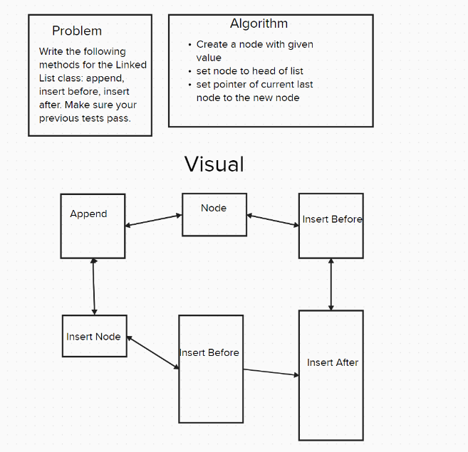

# Challenge Title
The challenge involved enhancing the functionality of a LinkedList class by implementing three specific methods: append, insert_before, and insert_after. 

## Whiteboard Process

## Approach & Efficiency
For implementing the append, insert_before, and insert_after methods in the LinkedList class, I took an approach that emphasizes clarity and adheres to the fundamental operations of a singly linked list. 