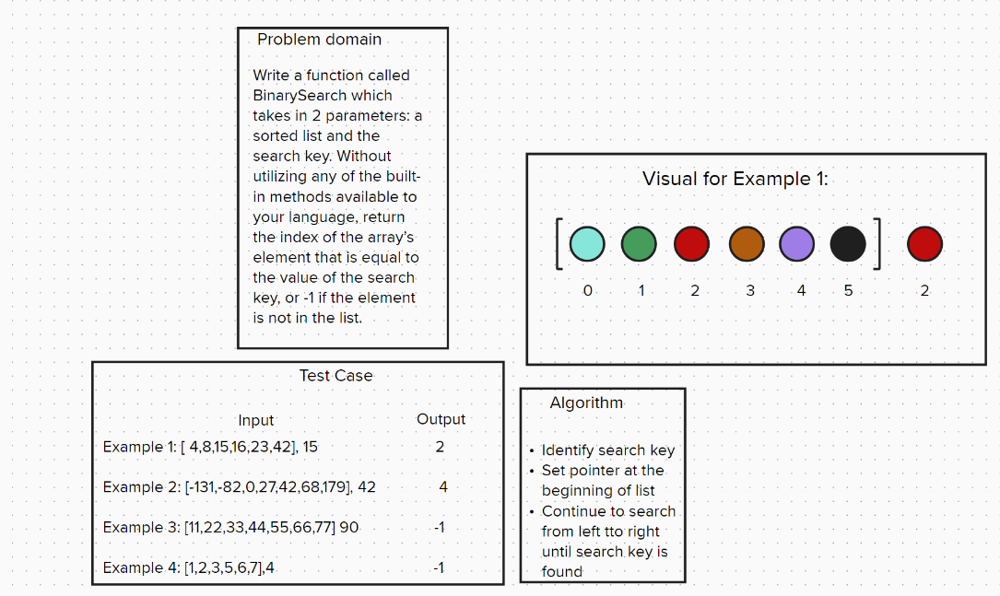

# Code Challenge 03 - Class 401d24

## Author
Kaitlin Davis | January 2024

## Challenge Title
Write a function called BinarySearch which takes in 2 parameters: a sorted array and the search key. Without utilizing any of the built-in methods available to your language, return the index of the array’s element that is equal to the value of the search key, or -1 if the element is not in the array.
NOTE: The search algorithm used in your function should be a binary search.

## Whiteboard Process

## Approach & Efficiency
I used the binary search approach for finding an item from a sorted list. The list repeatedly gets divided in half until the possible location can be found.

## Solution
def BinarySearch(arr, key):
    left = 0
    right = len(arr) - 1
    
    while left <= right:
        mid = (left + right) // 2
        if arr[mid] == key:
            return mid
        elif arr[mid] < key:
            left = mid + 1
        else:
            right = mid - 1
    
    return -1

## Resources
I used the help of ChatGPT for this assignment.