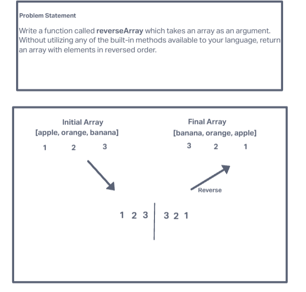

# Code Challenge 01 - Class 401d24

## Author
Kaitlin Davis | January 2024

## Challenge Title
Write a function called reverseArray which takes an array as an argument. Without utilizing any of the built-in methods available to your language, return an array with elements in reversed order.

## Whiteboard Process

## Approach & Efficiency
I decided to use a two-pointer approach where one pointer starts at the beginning of the array, and the other starts at the end. These pointers move towards each other, and I swap the elements at these pointers at each step until they meet or pass each other. 

## Solution
function reverseArray(arr):
    leftIndex = 0
    rightIndex = length(arr) - 1
    
    while leftIndex < rightIndex:
        swap arr[leftIndex] and arr[rightIndex]
        leftIndex++
        rightIndex--

    return arr

def reverse_array(arr):
    left_index = 0
    right_index = len(arr) - 1
    
    while left_index < right_index:
        # Swap the elements at the left_index and right_index
        arr[left_index], arr[right_index] = arr[right_index], arr[left_index]
        # Move the pointers towards the center
        left_index += 1
        right_index -= 1
    
    return arr

fruit_array = ['apple', 'orange', 'banana']

reversed_fruit_array = reverse_array(fruit_array)
reversed_fruit_array

## Resources
I used the help of ChatGPT for this assignment.