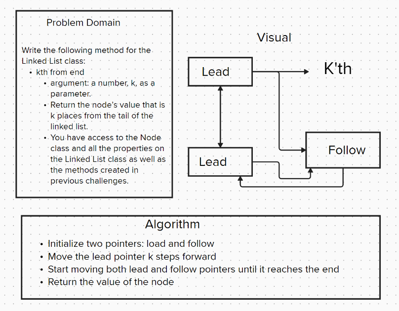

# Code Challenge 07 - Class 401d24

## Author
Kaitlin Davis | January 2024

## Challenge Title
Write the following method for the Linked List class:

* kth from end

    * argument: a number, k, as a parameter.

    * Return the node’s value that is k places from the tail of the linked list.

    * You have access to the Node class and all the properties on the Linked List class as well as the methods created in previous challenges.

## Whiteboard Process

## Approach & Efficiency
The `kth_from_end` method provides an efficient way to access elements from the end of a linked list using the two-pointer technique, ensuring linear time complexity with constant space usage.

## Resources
I used ChatGPT for help with this assignment. 