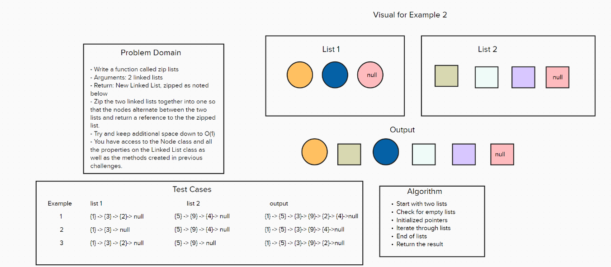

# Code Challenge 08 - Class 401d24

## Author
Kaitlin Davis | January 2024

## Challenge Title
- Write a function called zip lists

- Arguments: 2 linked lists

- Return: New Linked List, zipped as noted below

- Zip the two linked lists together into one so that the nodes alternate between the two lists and return a reference to the the zipped list.

- Try and keep additional space down to O(1)

- You have access to the Node class and all the properties on the Linked List class as well as the methods created in previous challenges.

## Whiteboard Process

## Approach & Efficiency
The zip_lists function combines two linked lists by taking turns with their nodes. It goes through both lists, switching their links so that they join together in a zigzag pattern. The function stops when it reaches the end of one list and then just adds on the rest of the other list. It's quick because it only goes through the lists once, and it doesn't use much extra memory. This function changes the original lists and works specifically with the type of linked list we've set up

## Resources
I used ChatGPT for help with this assignment. 