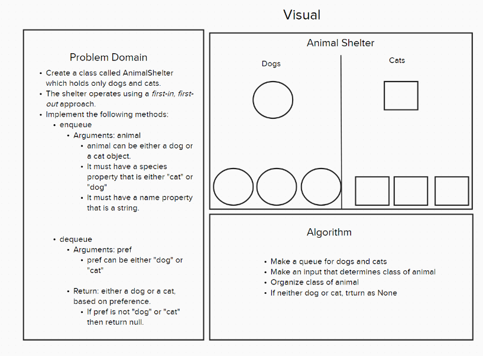

# Code Challenge 12 - Class 401d24

## Author
Kaitlin Davis || January 2024

## Challenge Title
Stack Queue Animal Shelter

## Whiteboard Process

## Approach & Efficiency
Class Design

* AnimalShelter Class: This class represents an animal shelter that operates on a first-in, first-out basis. It uses a queue to manage the animals (dogs and cats) in the shelter.

* Dog and Cat Classes: Similar to the previous approach, these classes represent dogs and cats. Each class has species and name attributes.

* Overall Space Complexity: O(N), where N is the number of animals in the shelter. This is the space required to store the animals in the two queues.

## Resources
I used ChatGPT for help with this assignment. 