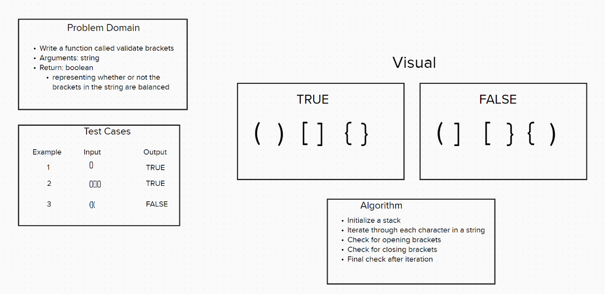

# Code Challenge 13 - Class 401d24

## Author
Kaitlin Davis || January 2024

## Challenge Title
Stack Queue Brackets

## Whiteboard Process

## Approach & Efficiency
The multi_bracket_validation function is designed to check if the brackets in a given string are balanced. It uses a stack data structure to keep track of the opening brackets `((, {, [)` and ensures that each of these is properly closed in the correct order with the corresponding closing brackets `(), }, ])`.

The function has a time complexity of O(n), where n is the length of the input string and a space complexity of the function O(n).

## Resources
I used ChatGPT for help with this assignment. 