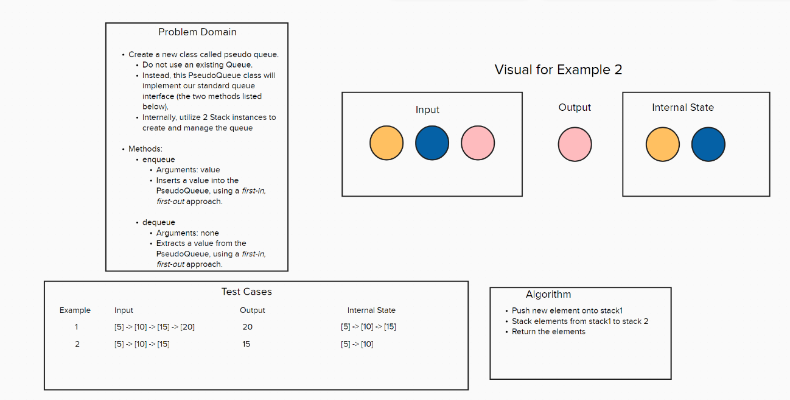

# Code Challenge 11 - Class 401d24

## Author
Kaitlin Davis | January 2024

## Challenge Title
PsuedoQueue Implementation

## Whiteboard Process

## Approach & Efficiency
The PseudoQueue class is a custom queue implementation that internally uses two stack instances to manage its elements. This approach allows for a first-in, first-out (FIFO) queue behavior using the last-in, first-out (LIFO) nature of stacks.

The key to this implementation is to reverse the order of the elements since a stack operates in LIFO order and a queue operates in FIFO order. This is achieved by the following steps:

Enqueue: Push elements onto stack1.
Dequeue:
If stack2 is empty, pop all elements from stack1 and push them onto stack2. This reverses their order.
Pop and return the top element from stack2.

O(n) - The space complexity is linear with respect to the number of elements in the queue, as all elements are stored within the two stacks.

## Resources
I used ChatGPT for help with this assignment. 