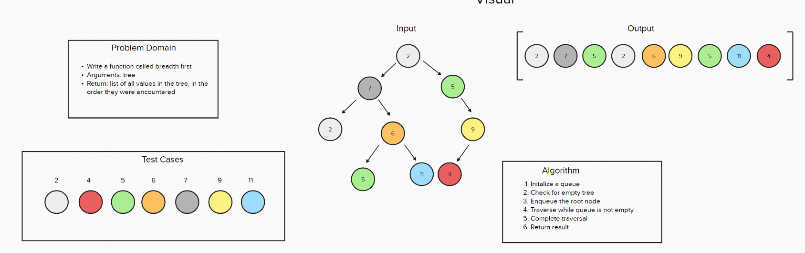

# Code Challenge 07 - Class 401d24

## Author
Kaitlin Davis | January 2024

## Challenge Title
Write a function called breadth first
Arguments: tree
Return: list of all values in the tree, in the order they were encountered

## Whiteboard Process

## Approach & Efficiency
The breadth_first function implements a level-order traversal of a binary tree using a queue. This approach ensures that nodes are visited in a breadth-first manner, where all nodes at a given depth are processed before moving to the next level. The function's time complexity is O(n), as it visits each node exactly once, where n is the number of nodes in the tree. Its space complexity is also O(n), primarily due to the queue potentially holding the maximum number of nodes at the tree's widest level. This method is efficient and straightforward for traversing trees in scenarios where level-based processing is required.

## Resources
I used ChatGPT for help with this assignment. 