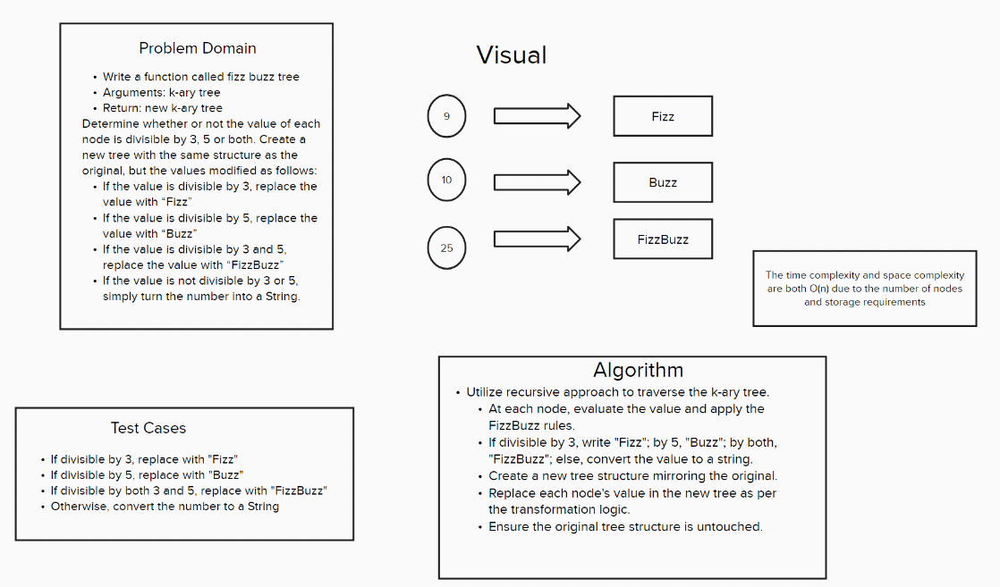

# Code Challenge 18 - Class 401d24

## Author
Kaitlin Davis | February 2024

## Challenge Title
Tree Fizz Buzz

## Whiteboard Process

## Approach & Efficiency
The fizz_buzz_tree function is designed to traverse a given k-ary tree and apply the "FizzBuzz" rules to each node's value. The rules are as follows:

If a node's value is divisible by 3, it is replaced with "Fizz".
If a node's value is divisible by 5, it is replaced with "Buzz".
If a node's value is divisible by both 3 and 5, it is replaced with "FizzBuzz".
If a node's value is not divisible by either 3 or 5, it is converted into a string representation of the original number.
The function implements these transformations without altering the original tree structure, returning a new k-ary tree that mirrors the structure of the input tree but with modified values according to the FizzBuzz rules.

## Resources
I used ChatGPT for help with this assignment. 