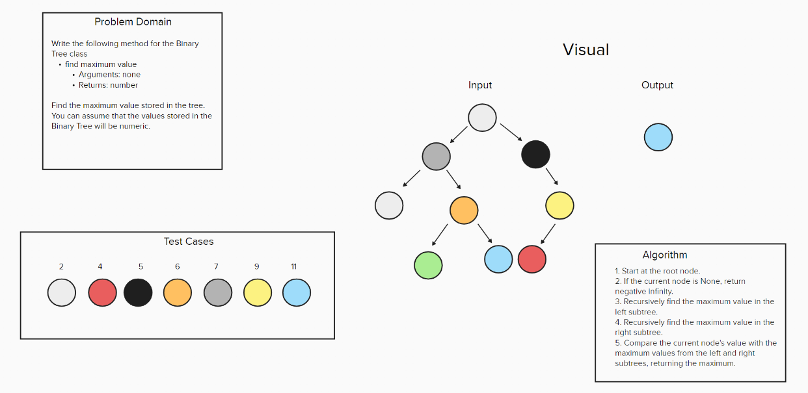

# Code Challenge 07 - Class 401d24

## Author
Kaitlin Davis | January 2024

## Challenge Title
Write the following method for the Binary Tree class

find maximum value
Arguments: none
Returns: number
Find the maximum value stored in the tree. You can assume that the values stored in the Binary Tree will be numeric.

## Whiteboard Process

## Approach & Efficiency
To find the maximum value stored in a binary tree, we use a recursive depth-first traversal approach. Here's how it works:

1. Start at the root node.
2. If the current node is None, return negative infinity.
3. Recursively find the maximum value in the left subtree.
4. Recursively find the maximum value in the right subtree.
5. Compare the current node's value with the maximum values from the left and right subtrees, returning the maximum.

The time complexity is O(n), and the space complexity is O(h) in practice (where "h" is the height of the tree).

## Resources
I used ChatGPT for help with this assignment. 